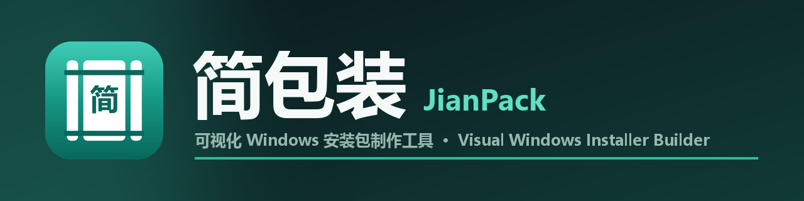
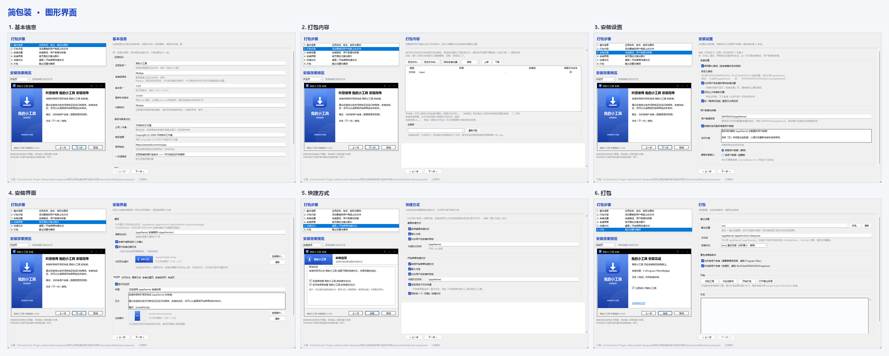
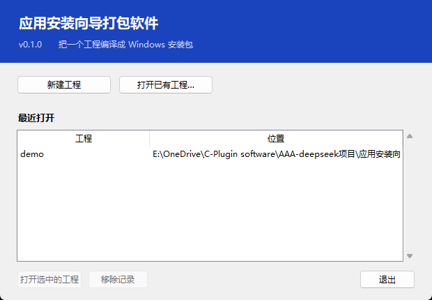
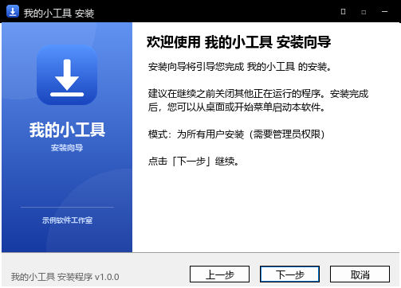
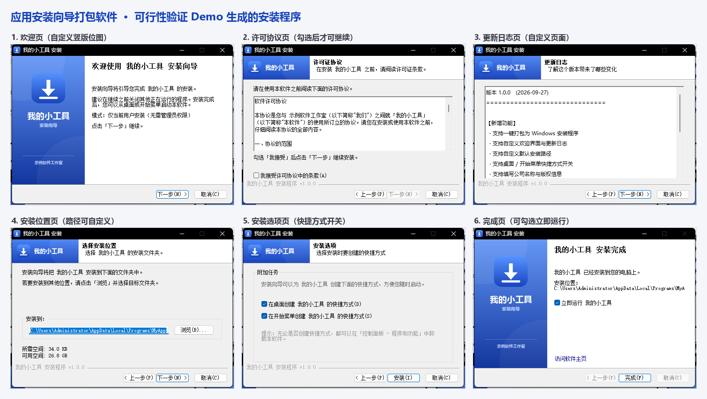

<p align="center">
  
</p>

<p align="center">
  <a href="https://github.com/kllber/jianpack/releases/latest"></a>
  <a href="LICENSE"></a>
  
  
  
  <a href="https://github.com/kllber/jianpack/releases"></a>
</p>

<p align="center">
  <a href="README.md"><kbd><b>简体中文</b></kbd></a>&nbsp;&nbsp;<a href="README.en.md"><kbd>English</kbd></a>
</p>

<p align="center">
  <a href="https://github.com/kllber/jianpack/releases/latest"></a>
</p>

---

# 简包装-应用安装向导打包软件

一个面向新手用户的可视化安装包制作工具 —— 把 Inno Setup Compiler 那套功能里
最常用的部分做简单，**界面中英双语**，而且**生成出来的安装包零依赖**：
对方双击就能装，不需要 .NET、Python 或任何运行时。

底层用 NSIS 作为打包引擎（zlib 类许可，允许随软件分发和商用）。

> **English:** *JianPack — a visual Windows installer / setup builder and an
> Inno Setup Compiler alternative, powered by NSIS. It builds small, dependency-free
> installers (no .NET / Python runtime needed on the target machine), through a
> bilingual Chinese / English GUI.*



---

## 一、当前版本与功能总览（v0.1.0）

| 模块 | 能力 |
|---|---|
| **6 步向导** | 基本信息 → 打包内容 → 安装设置 → 安装界面 → 快捷方式 → 打包 |
| **工程文件** | `.jianpack` 单文件容器（本质 zip：`project.json` + `assets/` + `payload/` …）；兼容老的「文件夹工程」，靠文件头自动识别；「另存为」统一产出单文件 |
| **双击打开** | 打包版启动时自动关联 `.jianpack`（写 HKCU，免管理员）；双击直接进主界面；首选项里可一键修复/取消 |
| **打包内容** | 添加文件/文件夹；**文件夹默认保留自己的名字**（可在弹窗里取消→只放内容，带实时预览）；支持 include/exclude 过滤；主程序自动识别；**移除条目时连同工程内 `payload\` 副本一起删**（外部引用不动） |
| **安装设置** | 默认/自定义安装路径、允许用户改路径、记住上次位置、显示占用空间；用户数据目录、卸载是否询问保留数据 |
| **安装界面** | 各页面的文案与图片（欢迎 / 许可协议 / 更新日志 / 安装位置 / 安装选项 / 完成页 + 页头图）；协议与日志支持「直接编辑」或「从 txt 导入」；**父项不勾选时子项自动变灰** |
| **快捷方式** | 桌面、开始菜单；启用 / 默认勾选 / 允许用户改 / 名称 / 同名子文件夹 / 卸载快捷方式 |
| **打包** | 输出位置（默认桌面）、文件名模板、压缩方式、多版本（所有用户 / 当前用户，可同时生成）；**打包进度窗**；实时日志 |
| **实时预览** | 覆盖 7 种页面，跟随编辑内容与**第 6 步勾选的版本**自动切换；`Ctrl+P` 显隐 |
| **图片** | 图标、页头图、欢迎图丢任意格式图片 → 弹裁剪窗（拖动/缩放）→ 自动摆正、透明压白底、导出 BMP / 多尺寸 ICO |
| **加载提示** | 打开工程时显示**加载窗**：双击 `.jianpack`/启动软件用带图标版，软件内开工程用简化无图标版；**读得快就不弹**，慢的时候才显示并给**真实解压进度** |
| **界面** | 中英双语；浅色 / 深色主题；**复选框为自绘 ✓**（不受系统主题影响） |
| **首选项** | 语言 / 主题 / 启动习惯 / 文件关联修复 / 缓存目录（「用默认位置」+「清空缓存文件…」）/ 恢复默认设置 |
| **内置教程** | 8 章图文，中英两套（配图由脚本用真实界面生成），独立非模态窗口 |
| **命令行** | `validate` / `generate` / `build` / `pack` / `unpack` |
| **引擎** | 内嵌便携版 NSIS；生成的安装包零依赖；支持静默安装/卸载 `/S` |
| **其它** | 自带只读演示工程；磁盘空间不足提前拦截；缓存/设置随文件夹便携 |

---

## 二、快速开始

### 图形界面

```powershell
python aipack.py                                     # 打开（先出启动窗口）
python aipack.py gui demo\feasibility\demo.jianpack    # 直接打开指定工程
```

- **启动选择窗口**：新建工程 / 打开已有工程 / 最近打开（第一行固定是自带的
  「演示测试项目」，蓝色、不可移除）/ 退出。
- 第一次打开会先弹**欢迎页**（一句话说明 + 「打开教程」，可勾「不再显示」，左下角可切中/英）。
- 进主界面后按 6 步走。最后一页点「开始打包」。



### 命令行

```powershell
# 1) 装 NSIS 编译器（只需一次；打包版不用，已内嵌便携版）
winget install NSIS.NSIS

# 2) 校验工程
python -m app validate demo\feasibility\demo.jianpack

# 3) 生成脚本并编译
python -m app build demo\feasibility\demo.jianpack
```

或在别的目录用 `aipack.py`（不依赖当前目录）：

```powershell
python "D:\...\应用安装向导打包软件项目\aipack.py" build "D:\...\demo.jianpack"
```

`pip install -e .` 之后可以直接用 `aipack` 命令。

### 做成 exe 分发

```powershell
python tools\vendor-nsis.py     # 把系统里的 NSIS 复制成 vendor\nsis（一次性）
python tools\build-exe.py       # 产出 dist\ 下的两个分发包
```

产出：

```
dist\
├── 简包装\     图形界面版（双击即用，含 _internal）
└── aipack\     命令行版（便于脚本化，含 _internal）
```

**分发方式：把 `dist\<文件夹>` 整个压缩发给别人，解压后双击里面的 exe 即可。**
对方不需要装 Python、NSIS 或任何运行时。

> **为什么是文件夹而不是单个 exe**：`--onefile` 每次启动都要把内嵌的 4 MB NSIS
> 解压到临时目录（还被实时防护逐个扫描），实测启动 30 秒以上；改成 onedir 后
> 是 0.5 秒。压缩后其实也就 12 MB 左右。

> **精简 `vendor\nsis` 时注意**：`Contrib\UIs` 不能删，MUI2 的 `MUI_INTERFACE`
> 会去加载 `Contrib\UIs\modern.exe`，删了直接编译失败。
> `makensis` 的查找顺序：显式指定 → 环境变量 `MAKENSIS` → 内嵌 `vendor\nsis` →
> 系统安装的 NSIS → `PATH`。

---

## 三、界面与流程要点

### 6 步向导

| 步骤 | 能做什么 |
|---|---|
| 1. 基本信息 | 应用名称、安装目录名、版本、文件版本、内部标识、公司/作者、版权、官网、描述、程序图标 |
| 2. 打包内容 | 添加文件/文件夹、调整安装后位置（**文件夹可保留名字或只放内容**）、指定主程序、移除条目 |
| 3. 安装设置 | 默认安装路径 / 自定义路径、是否允许用户改、记住上次位置、显示占用空间、用户数据目录、卸载时是否询问保留数据 |
| 4. 安装界面 | 各页面的文案与图片；协议/日志 直接编辑或 txt 导入；页头图 |
| 5. 快捷方式 | 桌面 / 开始菜单：启用、默认勾选、允许用户改、名称、同名子文件夹、卸载快捷方式 |
| 6. 打包 | 输出位置、文件名模板、压缩方式、**要生成哪些版本**、开始打包、实时日志 |

**两个"只在第 6 步选"的东西（重要）**：
- **安装给「所有用户 / 仅当前用户」**：第 3 步**不再**有单选，统一在第 6 步多选，
  且**可以两种一起生成**；实时预览按第 6 步勾选的第一个版本来画，和成品一致。
- 勾了多个版本时，文件名自动加 `-PerMachine` / `-PerUser` 后缀，避免互相覆盖。

### 界面布局

```
┌──────────────┬────────────────────────────────────┐
│ 打包步骤      │                                    │
│ 1. 基本信息   │                                    │
│ 2. ...       │           编辑区（吃掉全部剩余宽度）  │
│ ...          │                                    │
├──────────────┤                                    │
│ 安装效果预览  │                                    │
│  [安装向导]   │                                    │
└──────────────┴────────────────────────────────────┘
```

左栏固定宽度，右栏编辑区跟着窗口走。**窗口够宽时，分组框会自动排成两列**
（窗口窄的时候还是单列）。标题栏的「最大化」按钮被去掉了（版面按普通窗口宽度排，
铺满会显得空），但仍可拖边框改大小；万一被别的途径最大化会自动还原。

### 实时预览

左栏下方常驻。跟着你当前编辑的页面自动切换，也可用下拉框挑；只列出**真正会出现**的页面。
按真实版式绘制（窗口 503×362 等），但字体/换行可能与最终安装程序差一两行。
菜单「视图 → 显示安装预览」(`Ctrl+P`) 可显隐，选择会被记住。



### 图片不用自己做

程序图标、内页页头图、欢迎页图：丢一张任意格式（PNG/JPG/BMP/GIF/WEBP）进去，
弹裁剪窗拖动/缩放，右侧看真实效果，确定后自动转成 150×57 / 164×314 BMP、
256×256 多尺寸 ICO。**原图不会被改动。**


### 加载提示 & 打包进度

- **打开工程**：先显示加载窗（双击/启动=带图标版；软件内打开=简化无图标版）。
  **读得快（小工程）就不弹**，避免"闪一下像 bug"；一旦弹出至少停留约 0.8 秒，
  并显示真实解压进度。
- **开始打包**：弹带图标进度窗，显示当前编到第几个版本 + 滚动进度条 + 输出文件名，
  完成/失败自动关闭。

### 首选项 / 设置（`Ctrl+,`）

界面语言（中文/English，切换后重载界面）· 界面主题（浅色/深色）·
启动习惯（欢迎页、自动打开上次工程、默认显示预览）· 文件关联（修复/取消）·
缓存目录（**「用默认位置」只清路径不删文件**；**「清空缓存文件…」删除缓存的临时工程，
跳过正在用的那个**）· 「恢复默认设置」= 初始化。

### 内置教程

菜单「帮助 → 教程」(`F1`)：左侧目录 + 右侧图文，中英两套，独立非模态窗口，
不挡主界面。配图由 `tools\make-tutorial-images.py` 用真实界面生成。

---

## 四、生成的安装包长什么样

中文安装向导：欢迎 → 许可协议 → 更新日志 → 选安装位置 → 安装选项 → 进度 → 完成。



两种安装模式（可在第 6 步一次都生成）：

| | 为所有用户 | 仅当前用户 |
|---|---|---|
| 位置 | `Program Files` | `%LOCALAPPDATA%\Programs` |
| 权限 | 需要管理员（UAC） | 免提权，双击就装 |
| 快捷方式 | 所有用户可见 | 仅当前用户 |
| 注册表 | `HKLM` | `HKCU` |

- 正常卸载：写进「控制面板 → 程序和功能」，带图标、版本、发行者；可选保留用户数据。
- 静默安装：`/S`（安装和卸载都支持）。
- 体积小：示例包约 100 KB（不含你的程序文件）。
- 文字变量：`{appName}/{appVersion}/…` 打包时替换；`$INSTDIR/$APPDATA/…` 安装时由 NSIS 替换。

**输出位置**：默认输出到**桌面**（跟随 OneDrive 之类的重定向）；第 6 步「输出位置」
可改成任意目录（相对路径按工程文件所在目录算），留空恢复桌面。

---

## 五、便携与数据位置

```
<软件目录>\
├── 简包装.exe
├── _internal\          运行时（含 assets：图标、教程图、演示工程；vendor\nsis）
└── data\               运行时生成
    ├── settings.json   设置（最近打开、语言、主题、缓存目录…）
    └── work\           缓存：解开的工程 + 编译中间产物（关软件时清）
```

设置、缓存、演示工程都在软件目录内，整个文件夹可随意搬移。
软件目录不可写（如解压到 `Program Files`）时，才回退到 `%APPDATA%\简包装`。
磁盘空间不足会提前拦下并提示。

---

## 六、最近更新（这一轮做了啥）

**新增功能**
- 打开工程的**加载窗**（带图标 / 简化无图标两种）+ **真实解压进度** + 延迟显示。
- **打包进度窗**（按版本计数 + 滚动条 + 输出文件名）。
- 打包内容：**每个文件夹条目「保留文件夹名」开关**（弹窗带实时预览 + 列表新增一列）。
- **父项不勾选 → 子项变灰**（第 3/4/5 步全面联动；值仍保留）。
- 首选项缓存：按钮改名「**用默认位置**」，新增「**清空缓存文件…**」。
- 复选框改为**自绘 ✓**（原来某些主题画成 ✗）。

**行为调整**
- 「安装模式」从第 3 步**移到第 6 步多选**；预览跟随第 6 步，消除"预览与成品不一致"。
- 移除条目时**清理工程内 `payload\` 副本**，不再残留孤儿文件、不再反复弹"覆盖"。
- 教程**全套配图（中英）重新生成**，文字同步。

**修复的重要 bug**
- 中文输入法里打 `p`/`t` 后回车会误触「教程」/「打包」。
- 源文件缺失 + 未指定主程序时校验直接崩。
- 添加文件夹后文件被**摊平**到安装根目录（文件夹名丢失）。
- 打开大工程**没有反馈**（已由加载窗解决）。

---

## 七、验收 / 自检（改完必须跑）

```powershell
python tools\self-test.py                        # 回归自检：必须 0 失败、stderr 干净
python -m app validate demo\feasibility\demo.jianpack
python -m app build    demo\feasibility\demo.jianpack
powershell -ExecutionPolicy Bypass -File demo\feasibility\verify.ps1   # 15/15
python tools\gui-build-test.py demo\feasibility\demo.jianpack            # 界面里真跑一遍打包
python tools\build-exe.py                                              # dist\ 里的 exe 不依赖系统 NSIS
```

`self-test.py` 覆盖：工程读写无损、界面逐页走查、启动流程、图片裁剪转换、内嵌文本、
预览联动、排版边界、教程窗口、首选项、深浅主题、单文件工程与临时目录清理、
演示项目只读保护、缓存/设置位置、磁盘空间拦截、双击路径识别、文件夹安装路径、
移除条目清理、加载窗/进度窗、父项变灰联动、缓存按钮等（第 1~23 组）。

---

## 八、目录结构

```
app/                       设计器核心（Python，标准库 + Pillow）
├── core/                  工程层
│   ├── project.py         .jianpack 数据模型、加载、派生值、校验、文件夹安装路径
│   ├── serialize.py       写到磁盘（读在 project.py）
│   ├── container.py       单文件 .jianpack 的解包/打包/进度/安全校验
│   ├── assoc.py           .jianpack 文件关联（HKCU，双击打开）
│   ├── settings.py        本软件设置（最近打开、语言、主题、缓存目录…）
│   ├── paths.py           路径解析 + 桌面目录
│   └── errors.py          错误类型
├── engine/                打包层
│   ├── nsi.py             工程 -> NSIS 脚本（含文件夹保留名字的处理）
│   ├── assets.py          编码转码 + 图标/位图尺寸校验
│   ├── textutil.py        占位符展开 + NSIS 字符串转义
│   └── makensis.py        定位并调用 makensis.exe
├── ui/                    图形界面
│   ├── main_window.py     主窗口、步骤导航、打开工程（异步 + 加载窗）
│   ├── splash.py          加载窗 / 打包进度窗（带图标与简化两种）
│   ├── start_dialog.py    启动选择窗口
│   ├── welcome_dialog.py  启动欢迎页
│   ├── preferences_dialog.py  首选项（含缓存按钮）
│   ├── new_project_dialog.py  新建工程
│   ├── item_dest_dialog.py    修改安装位置 + 「保留文件夹名」
│   ├── image_crop_dialog.py   图片裁剪
│   ├── preview.py         安装效果实时预览
│   ├── tutorial.py / tutorial_content.py  教程窗口与内容
│   ├── theme.py           浅色/深色主题（含自绘 ✓ 复选框）
│   ├── i18n.py            中英文案表
│   ├── resources.py / state.py / widgets.py
│   └── pages/             6 个步骤页（base 里含「父项变灰」通用机制）
├── checks.py              统一校验入口（CLI 与界面共用）
├── cli.py                 命令行入口
└── __main__.py            python -m app

docs/工程文件格式.md         .jianpack 规范（字段速查、校验规则、NSIS 映射）
tools/                     开发与验收脚本（见上）
demo/feasibility/          可行性验证 demo（也是生成器的第一个测试用例）
data/                      软件自己的数据（运行时生成）
assets/                    软件图标 + demo + 教程配图
design/简装-图标/          程序图标设计稿
vendor/nsis/               随软件分发的便携版 NSIS（zlib 类许可）
dist/                      打包结果
```

---

## 九、作者 / 开源

- 作者：**kllber**
- GitHub：<https://github.com/kllber>
- 邮箱：1394141383@qq.com
- 许可：**Apache-2.0**（详见 [LICENSE](LICENSE) 与 [NOTICE](NOTICE)）

本软件是**开源工具**，欢迎使用、分发和反馈问题。开发过程中使用了
**DeepSeek V4.1 Flash** 进行辅助创作。

> **免责声明**：本软件按「现状」提供，不附带任何明示或暗示的担保。
> 请确保你拥有所打包内容的合法权利，并遵守相关法律法规；
> 因使用本软件产生的任何直接或间接后果由使用者自行承担。
