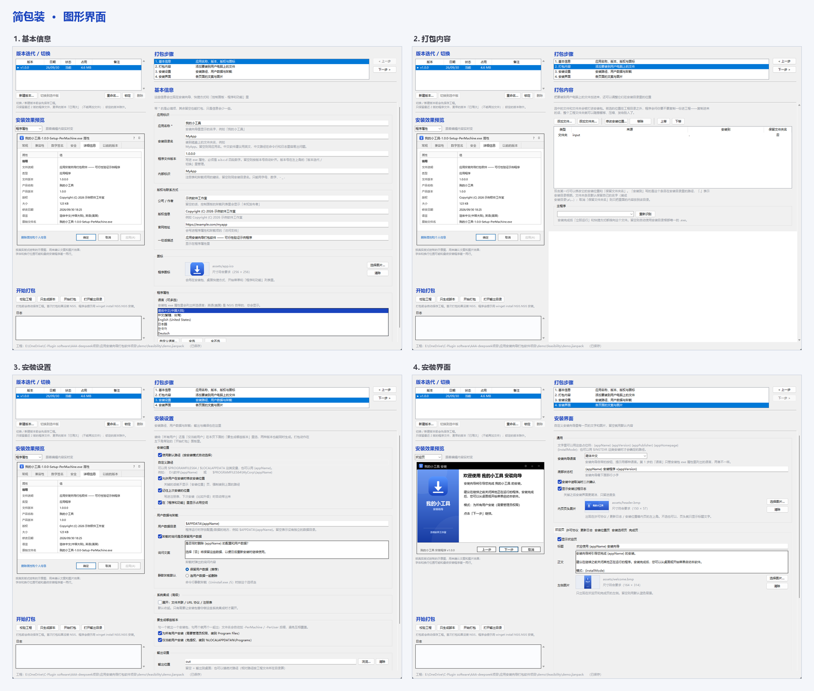
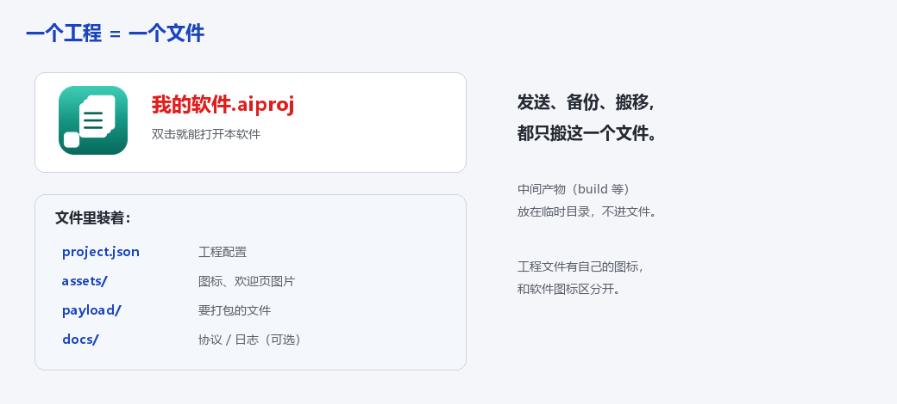

<p align="center">
  
</p>

<p align="center">
  <a href="https://github.com/kllber/jianpack/releases/latest"></a>
  <a href="LICENSE"></a>
  
  
  
  <a href="https://github.com/kllber/jianpack/releases"></a>
</p>

<p align="center">
  <a href="README.md"><kbd><b>简体中文</b></kbd></a>&nbsp;&nbsp;<a href="README.en.md"><kbd>English</kbd></a>
</p>

<p align="center">
  <a href="https://github.com/kllber/jianpack/releases/latest"></a>
</p>

---

# 简包装-应用安装向导打包软件

一个面向新手用户的可视化安装包制作工具 —— 把 Inno Setup Compiler 那套功能里
最常用的部分做简单，**界面中英双语**，而且**生成出来的安装包零依赖**：
对方双击就能装，不需要 .NET、Python 或任何运行时。

底层用 NSIS 作为打包引擎（zlib 类许可，允许随软件分发和商用）。

> **English:** *JianPack — a visual Windows installer / setup builder and an
> Inno Setup Compiler alternative, powered by NSIS. It builds small, dependency-free
> installers (no .NET / Python runtime needed on the target machine), through a
> bilingual Chinese / English GUI.*



---

## 一、认识简包装

把「一个文件夹里做好的程序」做成一个安装包，发给别人双击就能装——不用解压，
也不用自己在一堆文件里找 exe。整个过程是「填几个字段、点几下」，**不用写一行脚本**。

主界面就 4 块（见上图）：

- **版本迭代 / 切换**（左上）：把一个工程保存成多个版本，随时一键切回；
- **打包步骤**（右上）：4 步向导的目录，下面就是编辑区；
- **安装效果预览**（左中）：按真实版式画出安装向导长什么样，跟着编辑实时变化；
- **开始打包**（左下）：校验、生成脚本、打包、打开输出目录，以及实时日志。

## 二、特色与定位

和 Inno Setup Compiler、手写 NSIS 脚本这类工具相比，简包装走的是「够用、好上手」的路线：

- **不用写脚本**：所有功能都是界面上的字段和开关，新手也能做出规范安装包；
- **中英双语**：界面和内置教程都有中文、英文两套；
- **绿色便携、零依赖**：软件就是一个文件夹，内嵌便携版 NSIS，拷到别的电脑不用装任何东西；
- **工程是单文件**：图标、程序文件、界面设置、历史版本都在一个 `.jianpack` 里；
- **版本迭代**：同一个工程里保存多个版本、一键切换（同类工具里少见）；
- **所见即所得**：左侧实时预览；任意格式的图片丢进去就自动裁剪成规定尺寸。

也说清楚目前**还不及同类软件**的地方：不支持脚本级定制、没有增量升级 / 补丁 / 自动更新，
安装页面的种类也基本固定。需要这些时，Inno Setup Compiler 会更合适。


## 三、快速上手（4 步）

1. 打开软件，在启动窗口点「新建工程」，填好名称和位置（只创建一个 `.jianpack` 工程文件）。
2. 按左侧向导走 **4 步**：

   **① 基本信息** → **② 打包内容** → **③ 安装设置** → **④ 安装界面**

   （填应用名称、加入要打包的文件、选安装位置与输出、改各页面的文字和图片。）
3. 点左下角常驻的「**开始打包**」。安装包默认输出到**桌面**。

> **想看得更细？** 软件里按 **F1**（或菜单「帮助 → 教程」）有**共 6 章的图文教程**，
> 从「它是什么」一直讲到「进阶用法」，中英双语，可以边看边做。



## 四、功能一览

- **工程与版本**：单文件 `.jianpack`；版本迭代 / 切换（只保留最近 2 版的程序文件，更早的自动「已淘汰」）；双击工程文件直接打开。
- **安装设置**：默认 / 自定义安装路径、是否允许用户修改、记住上次位置；用户数据与卸载询问；两种安装模式可一次生成；静默安装 / 卸载 `/S`。
- **安装界面**：欢迎 / 许可协议 / 更新日志 / 安装位置 / 安装选项 / 完成页的文案与图片；协议与日志支持「直接编辑」或「从 txt 导入」；页头图与欢迎图；完成页「开机自启」。
- **系统集成与签名**：文件类型关联、URL 协议、自定义注册表项（安装写入、卸载清理）；打包后自动代码签名（Authenticode，证书自备）。
- **预览与图片**：左侧实时预览；图标 / 页头图 / 欢迎图丢任意格式图片，自动裁剪导出 BMP 与多尺寸 ICO。
- **其它**：中英双语界面、浅色 / 深色主题；命令行版（见下）。

每个功能的完整说明，见软件内置教程（**F1，共 6 章**）。

## 五、下载与运行

在 [Releases](https://github.com/kllber/jianpack/releases/latest) 下载便携版
`jianpack-vX.Y.Z-portable.zip`，解压后双击 **`简包装.exe`** 即可；整个文件夹可以随意搬移。
压缩包里还带一个命令行版 `aipack\`。

- **系统要求**：Windows 10 / 11（64 位）；不需要安装 Python、NSIS 或任何运行时。
- **设置与缓存**放在软件目录下的 `data\`，所以是绿色便携的。

命令行（`aipack\aipack.exe`）：

```text
aipack validate  工程.jianpack    只校验，不打包
aipack generate  工程.jianpack    只生成 .nsi 脚本
aipack build     工程.jianpack    生成脚本并编译出安装包
aipack pack      文件夹工程       把工程打成单个 .jianpack
aipack unpack    单个.jianpack    把单个工程解成文件夹
```

## 六、许可 / 作者

- 作者：**kllber**　·　GitHub：<https://github.com/kllber>　·　邮箱：1394141383@qq.com
- 许可：**Apache-2.0**（详见 [LICENSE](LICENSE) 与 [NOTICE](NOTICE)；第三方组件见 [THIRD-PARTY-NOTICES.md](THIRD-PARTY-NOTICES.md)）

本软件是**开源工具**，欢迎使用、分发和反馈问题。开发过程中使用了
**DeepSeek V4.1 Flash** 进行辅助创作。

> **免责声明**：本软件按「现状」提供，不附带任何明示或暗示的担保。请确保你拥有
> 所打包内容的合法权利，并遵守相关法律法规；因使用本软件产生的任何直接或间接后果
> 由使用者自行承担。
